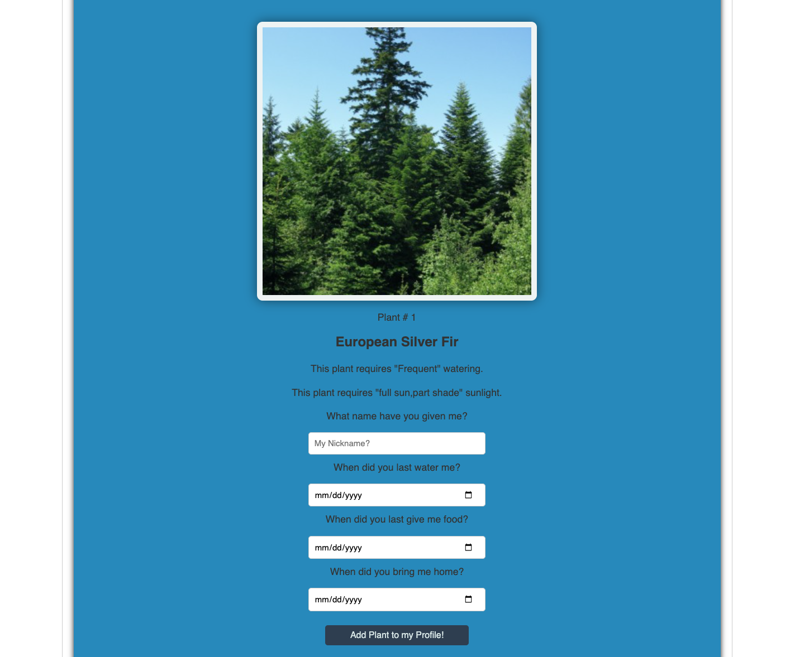
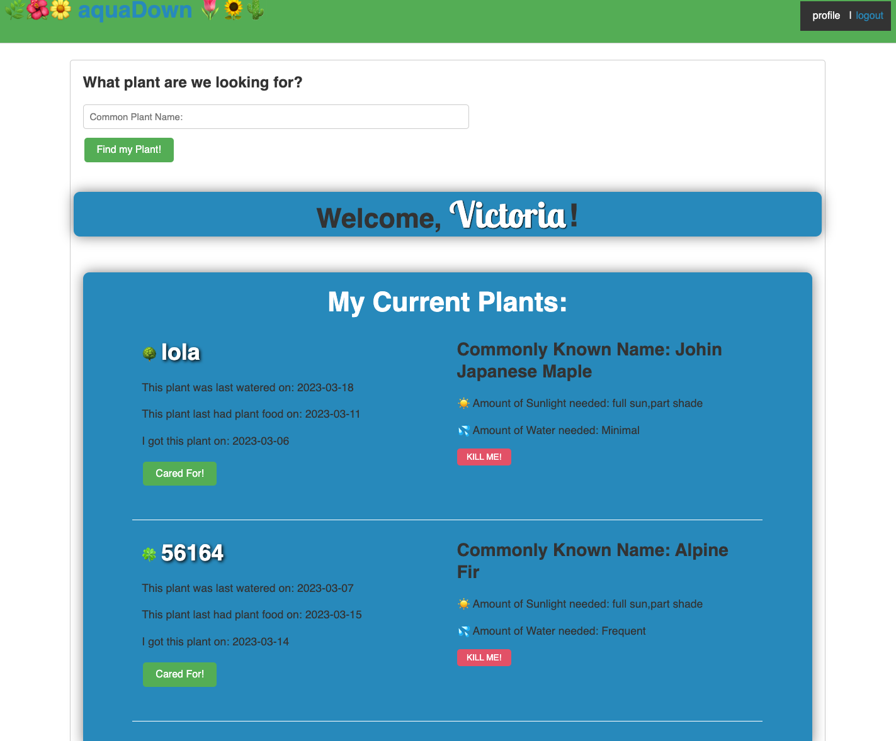

    

    
    
    
    
    

## Table of Contents

- [Overview](#overview)
- [Built With](#built-with)
- [Lisence](#lisence)
- [Features](#features)
- [Contact](#contact)

## Overview

  
search area for plants search

 
Plants results after name search.
 

 
 
Plants results after name search.
 
 
 
User profile with list of users saved plant.

## Built With

1.     [nodeJS](https://nodejs.org/en/docs/)

2.     [Sequelize](https://sequelize.org/)

3.     [mySql](https://www.mysql.com/about/legal/logos.html)

4.      [JavaScript]()

5.    [Express](https://expressjs.com/)

## Lisence

 

Copyright © 2007 Free Software Foundation, Inc. <https://fsf.org/>

Everyone is permitted to copy and distribute verbatim copies of this license document, but changing it is not allowed.

## Features

 **Aquadown:**  
is a plant care application that helps users take care of their plants by providing them with accurate and timely information about watering and sun exposure. The app is designed to be user-friendly and intuitive, with features that allow users to search for a plant they have just purchased and get care instructions for that specific plant.
Once users have found their plant in the app's database, they can input the date of the last time they watered and fed their plant. Aquadown will then remind them when it's time to water and feed their plant again . Wich is a feature that we will work on to soon incorporate into the application to further  help the user  maintain a healthy and thriving plant.
In addition to its watering and feeding reminders, Aquadown also provides users with information on how much sunlight their plant needs. The app's database includes thousands of different plant species, making it a valuable resource for plant enthusiasts of all levels.
Another great feature of Aquadown is that it allows users to name their plants. This can be a fun and personalized way to keep track of your plants and build a connection with them.
When the user  adds a new plant to the app, they can give it a unique name that is meaningful to the user. This can help  keep track of which plant is which, especially if you have multiple plants that are the same species. Naming your plants can also make caring for them feel more personal and enjoyable and is something the family can enjoy doing together.
Overall, Aquadown is a powerful tool for anyone who wants to keep their plants healthy and thriving. Whether you're an experienced gardener or just starting out, this app can help you take better care of your plants and enjoy their beauty and benefits for years to come.
 

## Contact

If you would like to contribute or have any questions , please contact us through **GitHub**:

 [Jr Li](https://github.com/NewJR666)

 [Tyler Dinslage](https://github.com/tylerdins88)

 [Heather Greenberg](https://github.com/hngreenberg)

 [Adrian Mora](mailto:moraadrian510@icloud.com)

**Thank You for your feedback!!**

---